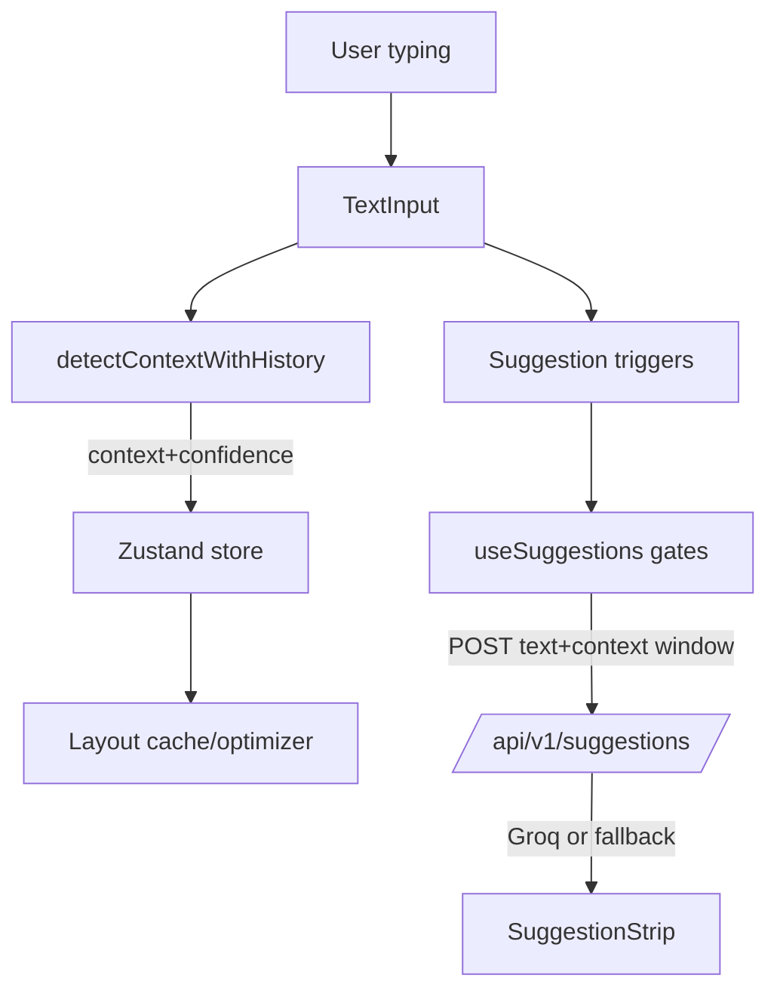
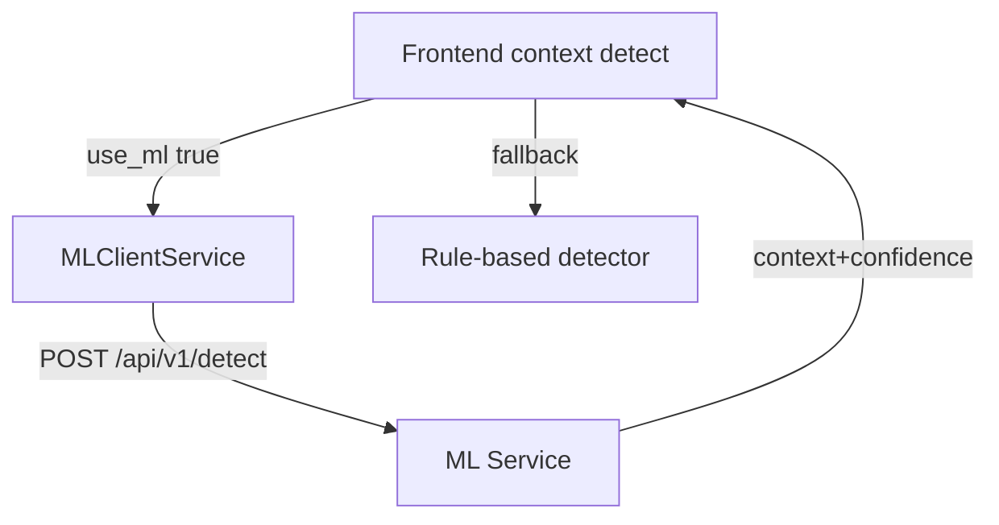

# ContextType Full Report

## Project Overview
- Intelligent adaptive keyboard that detects context (code/email/chat), optimizes key layout, and offers next-word suggestions.
- Three services: React front end, Node/Express backend(s), and a FastAPI ML service; optional Postgres/Redis via Docker.
- Core flows: client-side context detection with optional ML fallback, Groq-powered suggestion API with pattern fallbacks, and Fitts-law-based layout optimization.

## High-Level Architecture
- Frontend (`frontend`): Vite + React + TypeScript + Tailwind + Zustand state. Renders mobile-style keyboard, context indicator, metrics, optimization visualizer, and suggestion strip. Performs client-side context detection and key-frequency tracking for layout optimization.
- Backend LLM API (`backend/server.js`): Express service exposing `POST /api/v1/suggestions` and `GET /health`; calls Groq LLM (llama-3.1-70b-versatile) with context-specific system prompts and returns structured suggestions with confidences and types. Has rule-based and fallback suggestions when no API key.
- Backend Context API (`backend/src`): TypeScript Express app (with Socket.IO scaffolding) for context detection, layout retrieval, metrics logging, and study management. Uses rule-based detection with optional ML-service calls; Prisma schema defines Postgres models but persistence is TODO/mocked.
- ML Service (`ml-service`): FastAPI app serving `/api/v1/detect`, `/api/v1/train`, `/api/v1/metrics`, `/api/v1/load-pretrained`, `/health`. Uses TF-IDF + MultinomialNB (or rule-based) with preprocessing that preserves code symbols/emojis; stores models under `ml-service/models`.
- Data layer: Prisma schema for users, sessions, keystrokes, context detections, performance metrics, task completions, questionnaires, and keyboard layouts (Postgres). Docker compose provisions Postgres + Redis + ML service (backend container commented out).

```mermaid
flowchart LR
  User -->|types| Frontend
  Frontend -->|context detect (client)| ContextLogic
  Frontend -->|suggestions| LLMAPI
  Frontend -->|optional detect| MLService
  LLMAPI -->|Groq chat completion| Groq
  ContextLogic -->|API (optional)| ContextAPI
  ContextAPI -->|rule/ML| MLService
  ContextAPI -->|future| Postgres[(Postgres)]
  MLService -->|metrics/model| Models[(Models)]
```

## Frontend Walkthrough
- Entry (`src/App.tsx`): Initializes session, loads layout per context with caching, and manages compact vs full mode. Wires suggestion strip, mobile keyboard, heatmap, optimization visualizer, and context indicator. Detects context on debounced input using `detectContextWithHistory` (weighted recent text, cooldowns, boundary checks, strong-signal overrides).
- State (`contexts/store.ts`): Zustand store for context, layout, session, metrics, compact mode, and keystroke counts.
- Layout optimization (`utils/layoutOptimizer.ts` + `utils/fittsLaw.ts`): Generates context-specific key sets (letters + top symbols), applies key-frequency data and Fitts law to place keys; produces variants and recommendations.
- Context detection (`utils/contextDetector.ts`): Scores code/email/chat via keywords, symbols, slang, punctuation, and heuristics; hysteresis and cooldown to avoid rapid switching; strong-signal overrides for code/email/chat cues.
- Suggestions (`hooks/useSuggestions.ts` + `services/suggestionService.ts` + `components/SuggestionStrip.tsx`): Commit-signal and pause triggers with gating to limit API calls; extracts last 6-15 words as context window; caches responses; falls back to smart pattern suggestions per context when API fails.
- Keyboard/rendering: `components/MobileKeyboard.tsx` (touch interactions, swipe delete word), `LayoutPreferences.tsx` (toggle compact/heatmap), `KeyHeatmap.tsx`, `OptimizationVisualizer.tsx`, `ContextIndicator.tsx`, `TextInput.tsx`, `SymbolPanel.tsx`, etc. Compact mode hides advanced visuals.
- Styles/config: Tailwind config, environment `VITE_API_URL` for backend; defaults to `http://localhost:3000` (Context API) and `http://localhost:3001` (LLM API in suggestion service).

## Backend LLM API (`backend/server.js`)
- Routes: `GET /health` (status, Groq API configured flag); `POST /api/v1/suggestions` (via `routes/suggestions.js`).
- Flow: validate text/context -> attempt `getSmartSuggestions` for narrow patterns -> if Groq key present, call Groq LLM with context-specific system prompt -> parse JSON array -> map to `{text, confidence, type}` -> fallback suggestions if missing/invalid.
- Config: `GROQ_API_KEY`, `PORT` (default 3001), `FRONTEND_URL` for CORS.

## Backend Context API (`backend/src`)
- Server (`index.ts`): Express + Socket.IO; CORS; routes under `/api/v1/context`, `/layout`, `/metrics`, `/study`; health root endpoints; mock persistence; WebSocket hooks for keystroke/context broadcasts.
- Context detection (`controllers/context.controller.ts` + `services/context-detection.service.ts`): Rule-based scoring for code/email/chat; smoothing with previous context; returns alternatives/confidence; can call ML service via `MLClientService` when available.
- Layouts (`controllers/layout.controller.ts`): Returns mocked context-specific layouts and all-layout listing.
- Metrics (`controllers/metrics.controller.ts`): Mock keystroke logging and session/current metrics endpoints.
- Study (`controllers/study.controller.ts`): Participant/session creation, task listing, task completion, questionnaire submission (all mocked, using UUIDs).
- Routing: REST endpoints in `src/routes/*.ts` mirror controllers. Prisma schema (`prisma/schema.prisma`) defines tables for users, sessions, keystrokes, context detections, performance metrics, tasks, task completions, questionnaires, and keyboard layouts (Postgres provider).

## ML Service
- App (`ml-service/app/main.py`): FastAPI with CORS; endpoints: root listing, `/health`, `POST /api/v1/detect` (ML or rule-based prediction, returns alternatives, processing time, UUID), `POST /api/v1/train` (requires >=10 samples), `GET /api/v1/metrics`, `POST /api/v1/load-pretrained`.
- Model (`app/model.py`): TF-IDF (1-2 grams, max 1000 feats) + MultinomialNB; rule-based fallback with keyword/symbol scoring; save/load via joblib (`models/context_model.pkl`).
- Preprocessing (`app/preprocessor.py`): Lowercasing, preserves code symbols/emojis via placeholders, normalizes whitespace, exposes tokenization/stopword removal/feature extraction.
- Docker: `ml-service/Dockerfile` builds service; compose maps `./ml-service/models` for persistence.

## Data & Deployment
- Docker Compose (`docker-compose.yml`): Postgres (user/pass `contexttype/contexttype_dev_password`), Redis, ML service on 8000; backend container commented out; shared `contexttype-network`.
- Environment examples: `backend/.env.example` (PORT, GROQ_API_KEY, FRONTEND_URL, etc.), `frontend/.env.example` (VITE_API_URL), `ml-service/requirements.txt` lists FastAPI, scikit-learn, uvicorn, etc.
- Scripts: `backend` `npm start` / `npm run dev`; frontend `npm run dev`; batch helpers `start-backend.bat`, `start-frontend.bat`.

## Key Flows
- Suggestion Flow: Frontend `useSuggestions` -> POST to LLM API `/api/v1/suggestions` -> Groq completion -> suggestions strip; gate rules prevent spam; fallback patterns when offline.
- Context Detection Flow (client-first): TextInput change -> `detectContextWithHistory` computes weighted scores with cooldown/hysteresis -> store/context update -> layout regenerated (cached) -> optional call to Context API/ML service for server-side logging.
- Layout Optimization Flow: KeyFrequencyTracker accumulates presses -> `generateOptimizedLayout` combines default key sets + frequencies -> Fitts-law optimization -> layout rendered; user can toggle optimization/compact mode.
- Study/Telemetry (scaffolded): Keystroke/logging endpoints and Prisma schema ready for future persistence; currently mocked responses.





## Observations and Gaps
- Two backends exist: the LLM suggestion server (JavaScript) and the context/metrics/study API (TypeScript). Integration points are manual (frontend suggestion service points to port 3001; App uses client-side detection rather than server). Aligning to a single API host would simplify deployment.
- Persistence is stubbed: controllers return mock data and Prisma models are unused. DB migrations/seeding and actual CRUD wiring are needed for real studies/metrics.
- Non-ASCII artifacts appear in layouts/suggestions (e.g., placeholder emoji strings). Clean-up may be required for production.
- Docker compose excludes the main backend; add it or run locally via `npm start` in `backend` and set `VITE_API_URL` accordingly.

## Quick Start References
- Frontend: `cd frontend && npm install && npm run dev` (uses `VITE_API_URL` for backend host).
- LLM API: `cd backend && npm install && npm start` with `GROQ_API_KEY` set; optional `.env` for `FRONTEND_URL`.
- ML Service: `cd ml-service && pip install -r requirements.txt && uvicorn app.main:app --reload --port 8000` (or `docker compose up ml-service`).
- Database (future): `docker compose up postgres redis`; set `DATABASE_URL` for Prisma when wiring persistence.
